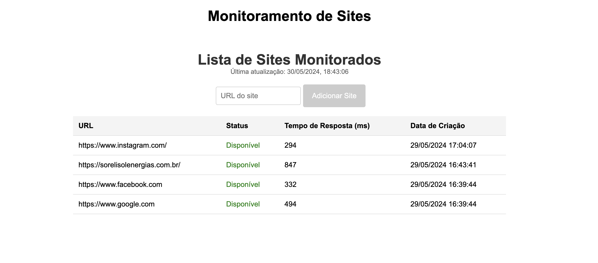

# Monitor de Sites - Frontend

Este projeto consiste em um frontend desenvolvido em Angular para visualizar o histórico de disponibilidade de sites monitorados. A aplicação permite que os usuários adicionem sites para monitoramento e visualizem o status de disponibilidade e o tempo de resposta dos sites monitorados.

This project was generated with [Angular CLI](https://github.com/angular/angular-cli) version 16.1.3.

## Estrutura do Projeto

monitor-de-sites-frontend/
│
├── src/
│   ├── app/
│   │   ├── components/
│   │   │   ├── site-form/
│   │   │   │   ├── site-form.component.html
│   │   │   │   ├── site-form.component.scss
│   │   │   │   ├── site-form.component.ts
│   │   │   ├── site-list/
│   │   │   │   ├── site-list.component.html
│   │   │   │   ├── site-list.component.scss
│   │   │   │   ├── site-list.component.ts
│   │   ├── services/
│   │   │   └── site.service.ts
│   │   ├── app.component.html
│   │   ├── app.component.scss
│   │   ├── app.component.ts
│   │   ├── app.module.ts
│   ├── assets/
│   ├── environments/
│   ├── index.html
│   ├── main.ts
│   ├── styles.scss
│   ├── polyfills.ts
│   └── test.ts
├── angular.json
├── package.json
└── tsconfig.json

## Funcionalidades

* Adicionar sites para monitoramento.
* Visualizar a lista de sites monitorados.
* Verificar o status de disponibilidade dos sites.
* Visualizar o tempo de resposta dos sites.

## Tecnologias Utilizadas

* Angular
* TypeScript
* HTML
* SCSS

## Pré-requisitos

* Node.js instalado
* Angular CLI instalado
* Backend e MongoDB rodando e configurados.

## Instalação

### Instalação do Angular CLI

O Angular CLI (Command Line Interface) facilita a criação e o gerenciamento de projetos Angular. Para instalar o Angular CLI, execute o seguinte comando:

```
npm install -g @angular/cli
```

### Clonar o Repositório

```
git clone https://github.com/JoanaRolim/monitor-frontend.git
cd monitor-de-sites-frontend
```

### Instalar Dependências

```
npm install
```

### Executar a Aplicação

```
ng serve
```

A aplicação estará rodando na porta `4200`. Você pode acessar a aplicação em [http://localhost:4200](http://localhost:4200/).

# Componentes

#### Serviço de Sites (SiteService)

* `site.service.ts: ` Este serviço é responsável por fazer requisições HTTP para o backend. Ele possui métodos para obter a lista de sites monitorados.

#### Formulário de Adição de Sites (SiteFormComponent)

Este componente fornece um formulário para o usuário adicionar um novo site para monitoramento.

* `site-form.component.html`: Template HTML para o formulário.
* `site-form.component.scss`: Estilos SCSS para o formulário.
* `site-form.component.ts`: Lógica do componente.

#### Lista de Sites (SiteListComponent)

Este componente exibe a lista de sites monitorados, incluindo seu status de disponibilidade e tempo de resposta. Ele utiliza o serviço `SiteService` para obter os dados do backend.

* `site-list.component.html`: Template HTML para a lista de sites.
* `site-list.component.scss`: Estilos SCSS para a lista.
* `site-list.component.ts`: Lógica do componente.

# Imagem da aplicação funcionando



# Precisa de Ajuda?

Acesse a página: [Angular CLI Overview and Command Reference](https://angular.io/cli)
